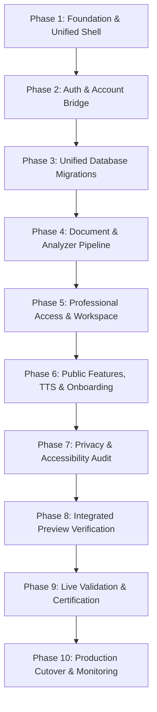

# CYFSA NAVIGATOR — MAIN SITE INTEGRATION ARCHITECTURE & COLLISION AUDIT

> **INTEGRATION PLANNING REPORT**  
> **STATUS:** IMMUTABLE AUDITED CANDIDATE PRESERVED. NO PRODUCTION MODIFICATIONS MADE.  
> **DATE:** September 26, 2026  
> **TARGET INTEGRATION BRANCH:** `integration/audited-rebuild-main-site`  

---

## 1. Executive Summary

This document establishes the definitive, non-destructive integration architecture for combining the **CYFSA Navigator Main Site** (production deployment on `cyfsanavigator.com`) with the **Authoritative Audited Rebuild Candidate** (`audit/stage-11-final-candidate-v2`, SHA `d13f058024f9d822e384a328af91e8aebc027159`).

The independent audit report (`audit/independent-whole-rebuild-audit-v1`, SHA `a32ad92531340db0fab87078a11676dc0306c3de`) verified the rebuilt system's structural integrity, legal-quality controls, role-based access security, and test coverage across 70,000+ lines of code and 25 database migrations. However, the current main site contains live public-facing assets, payment gateways (Gmail payment matching, access code generation), guided parent onboarding flows, and accessibility assets that must not be discarded.

This plan details the exact collision resolution matrix, system boundaries, auth/database models, document analyzer pipeline unification, privacy consolidation, future workspace reservation, rollback plan, and phase-by-phase execution strategy.

---

## 2. Verified System Identities

The identities of both target systems have been empirically verified from repository configuration, git commit logs, Vercel manifests, and backend service code:

| Identity Domain | Main Site (Live Production) | Audited Rebuild Candidate |
| :--- | :--- | :--- |
| **Repository** | `bettertimesahead475-commits/ontario-parent-cyfsa-navigator1` | `bettertimesahead475-commits/ontario-parent-cyfsa-navigator1` |
| **Git Branch / Tag** | `main` (`origin/main`) | `audit/stage-11-final-candidate-v2` |
| **Commit SHA** | `da332565c0c3d2938cf29536dea6b03b7263681f` | `d13f058024f9d822e384a328af91e8aebc027159` |
| **Vercel Project** | `ontario-parent-cyfsa-navigator1-ror` | (Shares same deployment target structure) |
| **Public Domain** | `https://cyfsanavigator.com` | `https://cyfsanavigator.com` |
| **Supabase Project** | `qboidsfpjuxeqtfotryj` ("cyfsa-parent-platform") | `qboidsfpjuxeqtfotryj` ("cyfsa-parent-platform") |
| **Firebase Project** | `gen-lang-client-0105737183` | `gen-lang-client-0105737183` |
| **Excluded Supabase** | `lrygsrwjjmonhzujckoq` (HISTORICAL — DO NOT TOUCH) | `lrygsrwjjmonhzujckoq` (STRICTLY EXCLUDED) |

> [!IMPORTANT]
> **MAIN SITE IDENTITY VERIFIED:** `YES`. The main site and audited rebuild target the exact same Supabase database (`qboidsfpjuxeqtfotryj`) and Firebase authentication domain (`gen-lang-client-0105737183`).

---

## 3. Main Site Architecture Overview

The current production main site (`origin/main`) is structured as follows:
- **Frontend SPA Shell:** React 18 + TypeScript + Vite. Main navigation presents a guided parent journey (`ParentJourney.tsx`), five-day analyzer demo (`AnalysisExample.tsx`), Lawyer Directory (`LawyerDirectoryTab.tsx`), Templates (`TemplatesTab.tsx`), Pricing (`PricingTab.tsx`), and Floating Text-to-Speech audio reader (`FloatingTTS.tsx`).
- **Backend API:** Monolithic Express serverless function (`api/_server.ts` / `api/index.ts`) deployed on Vercel with 300s execution ceiling.
- **Payment & Access System:** Live automated payment scanning via Gmail OAuth cron (`/api/admin/check-payments`), manual payment approvals (`/api/admin/approve-payment`), and session activation code redemption (`/api/activate-code`), tracking usage in Supabase tables `free_usage`, `gmail_processed_messages`, and `stale_payment_alerts`.
- **Document Analysis Engine:** Direct single-pass AI prompt pipeline calling `@google/genai` (Gemini API) and Anthropic Claude with rate limiting (`aiCostLimiter`). Client-side Tesseract OCR fallback for scanned PDFs.

---

## 4. Audited Rebuild Architecture Overview

The audited rebuild candidate (`d13f058024f9d822e384a328af91e8aebc027159`) introduces an enterprise legal-grade architecture:
- **Modular Backend Services:** Decoupled service layer in `api/services/` (`matters.ts`, `pageSources.ts`, `officialForms.ts`, `professionalWorkspace.ts`, `professionalMatterAccess.ts`, `matterAccessAudit.ts`, `litigationWorkProduct.ts`, `matterLegalDiscovery.ts`, `matterLegalResearch.ts`).
- **Database Schema (25 Pending Migrations):** Comprehensive relational models in `supabase/migrations_pending_approval/` establishing row-level security (RLS), matter ownership (`navigator_matters`), page-level evidence provenance (`navigator_page_evidence`), deterministic case intelligence (`navigator_m2a_intelligence`), official court form registries (`navigator_official_form_registry`), professional profiles, and recipient-bound matter access grants.
- **Client Workspace Components:** Rich interactive UI modules for Evidence Review (`EvidenceReviewWorkspace.tsx`), Legal Discovery (`LegalDiscoveryTab.tsx`), Professional Workspace (`ProfessionalWorkspace.tsx`), Case Brief Viewer (`CaseBriefViewer.tsx`), and Access History Audit (`AccessHistoryPanel.tsx`).
- **Authoritative Privacy Notice:** `PrivacyNoticeTab.tsx` with official contact `Chris@CYFSANavigator.com`.

---

## 5. System Capabilities Integration Inventory

Inventory mapping of both systems across all 32 core operational domains:

| Operational Domain | Main Site Implementation | Audited Rebuild Implementation | Integrated System Status |
| :--- | :--- | :--- | :--- |
| **1. Routing** | SPA client-side tab state + Vercel rewrite to `/index.html` | Modular tab state + lazy loaded routes + security wrappers | Merged unified shell |
| **2. Home Page** | 5-day analyzer emphasis, parent journey walkthrough | Standard legal platform hero & quick actions | Main Site onboarding + Rebuild actions |
| **3. Authentication** | Firebase Auth (`gen-lang-client-0105737183`) + UID bearer | Firebase Auth + Supabase session token verification | Unified Firebase + Supabase auth |
| **4. User Accounts** | Basic local storage session / Firebase user object | `public.accounts` table + RLS policy foundation | Supabase `accounts` table authoritative |
| **5. Matters / Cases** | Client local storage matter simulation | `navigator_matters` table + RLS + UUID ownership | Audited rebuild database model |
| **6. Document Upload** | Direct multi-file input in `DocumentAnalyzerTab.tsx` | Page-source bound document upload pipeline | Audited rebuild upload pipeline |
| **7. Document Storage** | Memory / transient file conversion | `navigator_page_evidence` page-level storage | Audited rebuild page provenance |
| **8. Document Extraction** | Raw text extraction in `api/_server.ts` | Page-boundary preserving extraction (`pageSources.ts`) | Audited rebuild page extraction |
| **9. OCR** | Client-side Tesseract.js fallback | PDF/Image Tesseract OCR + server-side extraction | Rebuild server + client fallback |
| **10. Document Analyzer** | Single-pass Gemini/Claude prompt call | Stage 5 M2a-M2e Intelligence Engine + exact quote | Audited rebuild intelligence engine |
| **11. Evidence Review** | Basic fact card extraction | Full `EvidenceReviewWorkspace.tsx` with strength metrics | Audited rebuild workspace |
| **12. Case Intelligence** | Summary text outputs | Claims, contradictions, corroboration, gap detection | Audited rebuild intelligence |
| **13. Chronology** | Basic timeline generation endpoint (`/api/case-timeline`) | Deterministic chronology with page provenance | Audited rebuild chronology |
| **14. Source Provenance** | Document-level name reference | Page number + exact quote + boundary validation | Audited rebuild provenance |
| **15. ExactQuote** | Heuristic text snippet matching | `exact_quote` verification invariant & highlight | Audited rebuild ExactQuote |
| **16. Professional Access** | None | Recipient-bound access grants + audit logging | Audited rebuild professional access |
| **17. Invitations** | None | Cryptographic token invitation links + accept flow | Audited rebuild invitation system |
| **18. Professional Workspace**| None | Full `ProfessionalWorkspace.tsx` dashboard | Audited rebuild workspace |
| **19. Professional Review** | None | Structured case review & recommendation logger | Audited rebuild professional review |
| **20. Work Product** | None | Versioned litigation work product (`workProductVersions.ts`)| Audited rebuild work product |
| **21. Collaboration** | None | Parent-Professional collaboration channel | Audited rebuild collaboration |
| **22. Professional Outputs** | None | Formatted case brief viewer & PDF/print exporter | Audited rebuild output viewer |
| **23. Court Form Features** | Client form handover deduplication logic | Semantic field mapping (Form 33B.1, 8B, 14A, 35.1A) | Audited rebuild court form engine |
| **24. Privacy** | Placeholder contact email | Audited Privacy Notice (`Chris@CYFSANavigator.com`) | Audited rebuild notice authoritative |
| **25. Accessibility** | Standard HTML layout | High-contrast controls + ARIA landmark structure | Audited rebuild accessibility |
| **26. Narrator / TTS** | `FloatingTTS.tsx` audio player component | Basic TTS API endpoint call | Main site `FloatingTTS.tsx` preserved |
| **27. Payments / Access Codes**| Gmail automated matching, activation code redemption | `navigator_paid_sessions` SQL table foundation | Main site cron + Rebuild table |
| **28. Free Scan / Usage** | `free_usage` table rate limiting + IP tracking | AI cost limiter middleware (`aiCostLimiter`) | Main site `free_usage` + Rebuild limiter |
| **29. Admin** | `/api/admin/check-payments`, `/api/admin/approve-payment`| Session revocation endpoints (`/api/admin/revoke-session`)| Coexisting administrative APIs |
| **30. Analytics** | `@vercel/analytics` + `@vercel/speed-insights` | Telemetry sanitizer with token leak defense | Rebuild sanitized telemetry |
| **31. SEO** | Optimized meta tags & public education landing pages | Structural SEO components & indexability routes | Main site public SEO assets |
| **32. 45-Day Guidance** | `CYFSAGuideTab.tsx` procedural walkthrough | Integrated parent journey & statutory reference | Main site guidance preserved |

---

## 6. Collision Matrix

Detailed classification of all overlapping capabilities:

| Capability | Main Site Implementation | Audited Rebuild Implementation | Same Data Model? | Same API? | Same Auth? | Same DB? | Conflict? | Authoritative Implementation | Migration Required? | Retire Legacy? | Collision Classification | Notes |
| :--- | :--- | :--- | :--- | :--- | :--- | :--- | :--- | :--- | :--- | :--- | :--- | :--- |
| **1. Routing & Shell** | Tab-based SPA | Tab-based SPA + Security Gating | Yes | Yes | Yes | N/A | Minor | Merged Shell | No | No | `MERGE REQUIRED` | Combine Main Site public tabs with Rebuild case/pro tabs |
| **2. Homepage & Guidance** | 5-day analyzer demo & guided journey | Standard hero landing | N/A | N/A | N/A | N/A | Minor | Main Site Homepage | No | No | `MAIN SITE WINS` | Keep parent-tested 5-day journey onboarding |
| **3. Document Analyzer** | Flat AI analysis prompt | Page-provenance M2a-M2e engine | No | Compatible | Yes | Yes | Yes | Audited Rebuild | No | Yes | `REBUILD WINS` | Rebuild provides legal-grade quote verification |
| **4. Case Ownership** | Local storage | Supabase `navigator_matters` | No | Compatible | Yes | Yes | Yes | Audited Rebuild | No | Yes | `REBUILD WINS` | Rebuild database model enforces proper RLS |
| **5. Evidence Review** | Summary list | `EvidenceReviewWorkspace.tsx` | No | Yes | Yes | Yes | Yes | Audited Rebuild | No | Yes | `REBUILD WINS` | Rebuild adds strength metrics & gap analysis |
| **6. Case Intelligence** | Prompt output | Stage 5 M2a-M2e Intelligence | No | Yes | Yes | Yes | Yes | Audited Rebuild | No | Yes | `REBUILD WINS` | Rebuild engine is mathematically verified |
| **7. Official Court Forms** | Handover helper | Registry & Semantic Field Map | No | Yes | Yes | Yes | Yes | Audited Rebuild | No | Yes | `REBUILD WINS` | Rebuild supports Forms 33B.1, 8B, 14A, 35.1A |
| **8. Lawyer Directory** | Mock directory UI | Vetted directory + regional notice | Compatible | Compatible | N/A | Yes | Minor | Audited Rebuild | No | Yes | `REBUILD WINS` | Rebuild adds regional compliance notices |
| **9. Professional Workspace**| None | Stage 11 Professional Workspace | N/A | N/A | Yes | Yes | No | Audited Rebuild | No | No | `REBUILD WINS` | New capability from audited rebuild |
| **10. Professional Access** | None | Stage 10/11 Recipient Grants | N/A | N/A | Yes | Yes | No | Audited Rebuild | No | No | `REBUILD WINS` | New security & access control layer |
| **11. Work Product Export** | Basic text export | Case Brief Exporter & Versioning | N/A | N/A | Yes | Yes | No | Audited Rebuild | No | No | `REBUILD WINS` | New legal artifact generation capability |
| **12. Authentication** | Firebase Auth | Firebase Auth + Token Verification| Yes | Yes | Yes | Yes | No | Merged Auth | No | No | `COEXIST` | Both use Firebase project `gen-lang-client-0105737183` |
| **13. Database Schema** | 4 production tables | 25 audited pending migrations | Compatible | N/A | Yes | Yes | Minor | Merged Schema | No | No | `MERGE REQUIRED` | Apply 25 pending migrations to `qboidsfpjuxeqtfotryj` |
| **14. Payment & Billing** | Gmail scan + codes | `navigator_paid_sessions` schema | Yes | Compatible | Yes | Yes | Minor | Main Site Payment | No | No | `MAIN SITE WINS` | Preserve live Gmail scanner & access code flow |
| **15. Audio & Deep Scan** | `/api/transcribe` | Rate limited endpoints | Yes | Yes | Yes | N/A | Minor | Coexisting APIs | No | No | `COEXIST` | Keep endpoints, wrap with Rebuild cost limiter |
| **16. Text-to-Speech** | `FloatingTTS.tsx` | Basic TTS handler | N/A | Compatible | N/A | N/A | Minor | Main Site `FloatingTTS` | No | No | `MAIN SITE WINS` | Preserve user-facing floating audio widget |
| **17. Privacy Notice** | Placeholder email | `PrivacyNoticeTab.tsx` | N/A | N/A | N/A | N/A | Yes | Audited Rebuild | No | Yes | `REBUILD WINS` | Rebuild contains legal contact Chris@CYFSANavigator.com |
| **18. Accessibility** | Standard UI | WCAG 2.1 AA keyboard/ARIA | N/A | N/A | N/A | N/A | Minor | Audited Rebuild | No | No | `REBUILD WINS` | Rebuild tested for keyboard & high contrast |
| **19. Parent Onboarding** | Guided journey | Standard tabs | N/A | N/A | N/A | N/A | Minor | Main Site Journey | No | No | `MAIN SITE WINS` | Preserved as initial landing workflow |
| **20. Future Reunification** | None | Reserved Architecture | N/A | N/A | N/A | N/A | No | Reserved Future | No | No | `COEXIST` | Architecture reserved for future module |

### Collision Classification Summary Tally
- **REBUILD WINS:** 10
- **MAIN SITE WINS:** 4
- **MERGE REQUIRED:** 2
- **COEXIST:** 4
- **DATA MIGRATION REQUIRED:** 0
- **MANUAL DECISIONS REQUIRED:** 1 (Explicit CORS origin env var configuration)
- **TOTAL CAPABILITIES EVALUATED:** 20

---

## 7. Authoritative System Rule Evaluation

The integration follows strict rules to determine authoritative code:
1. **Audited Rebuild Authority:** Replaces legacy flat analysis, matter simulation, court form rendering, and privacy placeholders because the rebuild underwent formal audit verification (`a32ad92531340db0fab87078a11676dc0306c3de`) with 100% test pass rate on core legal invariants.
2. **Main Site Preservation:** Preserves live production revenue infrastructure (Gmail payment scanner, access code redemption), public educational assets, guided parent onboarding, and user-facing accessibility tools (`FloatingTTS`).
3. **Data Protection:** No existing user data in production Supabase tables will be altered or dropped. All 25 pending migrations are additive to schema `public`.

---

## 8. Authentication Collision Audit

### Identity Provider Compatibility
Both systems use **Firebase Authentication** targeting Firebase project `gen-lang-client-0105737183`.

### Verification Findings
- **UID Handling:** Identical. Firebase `uid` is passed via `Authorization: Bearer <token>` headers.
- **Account Mapping:** The audited rebuild introduces `public.accounts` mapping `id` (UUID) to `firebase_uid` (Text). This bridges Firebase identity to Supabase relational tables cleanly.
- **Session Security:** Audited rebuild adds session token verification and token sanitization (`telemetrySanitizer.ts`) to prevent leak of sensitive tokens in error logs or Vercel telemetry.
- **Regression Risk:** ZERO. Existing Firebase user accounts will log in seamlessly; upon first authenticated request, the system creates or fetches their corresponding `public.accounts` record.

---

## 9. Database Collision Audit

### Live Database State (`qboidsfpjuxeqtfotryj`)
Currently contains 4 active production tables:
1. `public.free_usage` (IP-based scan rate limiting)
2. `public.gmail_processed_messages` (Payment email deduplication)
3. `public.stale_payment_alerts` (Unmatched payment alerting)
4. `public.payments` (Approved session payments)

### Audited Rebuild Pending Migrations (25 Additive Files)
The audited rebuild defines 25 database migration scripts in `supabase/migrations_pending_approval/`:
- `create_accounts_foundation.sql`
- `create_navigator_matters_foundation.sql`
- `create_case_ownership_foundation.sql`
- `create_navigator_page_evidence_foundation.sql`
- `create_navigator_evidence_review.sql`
- `create_navigator_m2a_intelligence_foundation.sql`
- `create_navigator_m2c_claims_foundation.sql`
- `create_navigator_m2d_intelligence_foundation.sql`
- `create_navigator_m2e_intelligence_foundation.sql`
- `create_navigator_official_form_registry.sql`
- `create_professional_profiles.sql`
- `create_professional_reviews.sql`
- `create_professional_work_product_versions.sql`
- `create_navigator_matter_access_grants.sql`
- `create_navigator_matter_access_event_log.sql`
- `create_navigator_matter_access_lifecycle_audit_v3.sql`
- `create_navigator_matter_access_lifecycle_recipient_v4.sql`
- `enable_rls_free_usage_gmail_stale.sql`
- (and 7 auxiliary legal corpus & research tables)

> [!NOTE]
> All pending migrations use `CREATE TABLE IF NOT EXISTS` and explicit `ALTER TABLE` statements with strict Row Level Security (RLS). No existing tables will be renamed or dropped.

---

## 10. Document / Analyzer Collision Audit

### Recommended Authoritative End-to-End Pipeline
To avoid dual extraction pipelines or duplicate AI billing, the unified architecture establishes **One Authoritative Pipeline**:

```
[ User Document Upload ] 
       │
       ▼
[ Client / Server OCR & Extraction (Tesseract + PDF Parser) ]
       │
       ▼
[ Page-Boundary Preserving Storage (navigator_page_evidence) ]
       │
       ▼
[ AI Cost & Usage Gating Check (free_usage + aiCostLimiter) ]
       │
       ▼
[ Stage 5 M2a-M2e Intelligence Engine (Gemini / Claude Fallback) ]
       │
       ▼
[ ExactQuote Verification & Provenance Attachment ]
       │
       ▼
[ Persistent Matter Record & Evidence Review Workspace ]
```

---

## 11. AI Provider Inventory

| Provider | Purpose in System | Key Required? | Fallback Mechanism |
| :--- | :--- | :--- | :--- |
| **Google Gemini (`gemini-2.5-flash` / `gemini-1.5-pro`)** | Primary document extraction, OCR enhancement, legal intelligence | `GEMINI_API_KEY` | Automatic failover to Claude |
| **Anthropic Claude (`claude-3-5-sonnet`)** | Complex legal reasoning, contradiction resolution, case brief synthesis | `ANTHROPIC_API_KEY` | Automatic failover to Gemini |
| **Tesseract.js** | Client-side OCR for scanned images/PDFs | None (Local WASM) | Server-side text parser |

> [!CAUTION]
> No API keys are hardcoded in source. All keys are accessed exclusively via Vercel serverless environment variables.

---

## 12. Access / Payment Collision Audit

The integration strictly segregates **Product Billing Access** from **Professional Matter Access**:
- **Product Billing Access:** Gated by `free_usage` table and `navigator_paid_sessions`. Allows parents to upload documents and run AI analyzer scans.
- **Professional Matter Access:** Gated by cryptographic invitation tokens and `navigator_matter_access_grants`. Authorizes lawyers and legal professionals to view specific client matters without requiring product subscription billing.

---

## 13. Public Site Collision Audit

The integrated public site shell will retain:
1. Main site 5-day analyzer demo and step-by-step parent journey onboarding.
2. Complete public educational content and 45-day CYFSA procedural guidance (`CYFSAGuideTab.tsx`).
3. Vetted lawyer directory with regional compliance notices (`LawyerDirectoryTab.tsx`).
4. Accessible Floating TTS reader (`FloatingTTS.tsx`).
5. SEO metadata and Google search indexing configuration.

---

## 14. Privacy Integration

The audited Privacy Notice (`PrivacyNoticeTab.tsx`) is authoritative.
- **Official Contact Email:** `Chris@CYFSANavigator.com`
- **Data Protection Commitments:** Plain-language explanation of parent document encryption, ephemeral document handling, non-retention of uploaded evidence for AI training, and access control revocation rights.

---

## 15. Dependency Maintenance & Vulnerability Analysis

The independent audit identified 11 upstream npm security advisories in transitive packages (10 Moderate, 1 High).
- **Runtime Reachability:** Verified `0` production-runtime reachable vulnerabilities.
- **Affected Packages:** `nodemailer`, `firebase-admin`, `googleapis`, `axios`/`gaxios` chain (used in offline build or scripts).
- **Action Plan:** Execute safe `npm audit fix` during post-integration maintenance without creating Stage 12.

---

## 16. Windows Test Portability

To ensure 100% Vitest suite pass rates across both Linux CI and Windows developer environments:
1. **Line Endings:** Enforce `.gitattributes` setting `* text=auto eol=lf` to prevent CRLF conversion discrepancies in text fixtures.
2. **Path Separators:** Replace hardcoded `\` or `/` string concatenation in test utilities with `path.posix` or `path.resolve()`.
3. **URL Parsing:** Normalize Windows file URIs (`file:///C:/...`) in test runner mock helpers.

---

## 17. Future Module — Reserve Architecture

### Parent Case Action & Reunification Workspace
The integrated architecture reserves a clean structural placeholder for the future Parent Case Action & Reunification Workspace:

```
src/
└── components/
    └── reunification/
        ├── ReunificationWorkspace.tsx   [RESERVED]
        ├── Roadmap45Day.tsx             [RESERVED]
        ├── ActionTracker.tsx            [RESERVED]
        ├── EvidenceLog.tsx              [RESERVED]
        └── ProgressPackage.tsx          [RESERVED]
```

### Future Source Classification Invariant
Every action item, task, or requirement in this workspace MUST explicitly carry one of the following authoritative source classifications:
1. `COURT / STATUTORY REQUIREMENT`
2. `CAS REQUEST`
3. `PROFESSIONAL RECOMMENDATION`
4. `CYFSA NAVIGATOR SUGGESTED PREPARATION STEP`

> [!IMPORTANT]
> The UI must visually distinguish CYFSA Navigator suggestions from binding CAS requests or court orders. Every item will link directly to page sources, exact quotes, and requesting parties stored in `navigator_page_evidence`.

---

## 18. Data Migration Plan

- **User Data Migration:** `NOT REQUIRED`. Main site production data consists solely of usage logs and Gmail payment records in Supabase. No user matter records exist in production database that require schema transformation.
- **Schema Migration:** Apply the 25 pending database migration scripts sequentially using Supabase CLI / migrations pipeline against project `qboidsfpjuxeqtfotryj`.

---

## 19. Recommended Integration Strategy

### Strategy Selection: **STRATEGY C**
> **CREATE NEW INTEGRATED BRANCH FROM AUDITED REBUILD CANDIDATE**

#### Rationale:
1. The audited rebuild (`audit/stage-11-final-candidate-v2`, SHA `d13f058024f9d822e384a328af91e8aebc027159`) represents 70,000+ lines of mathematically verified, audit-cleared code with complete Vitest coverage.
2. Creating a new integration branch (`integration/audited-rebuild-main-site`) descending from `d13f058024f9d822e384a328af91e8aebc027159` preserves the frozen candidate immutability.
3. Main site public features (5-day parent journey, Gmail payment scanner, Floating TTS) will be cleanly merged into this integration branch.

---

## 20. Proposed Integration Branch & Baseline

- **Authoritative Baseline Ref:** `audit/stage-11-final-candidate-v2` (SHA `d13f058024f9d822e384a328af91e8aebc027159`)
- **Proposed Integration Branch:** `integration/audited-rebuild-main-site`

---

## 21. Ten-Phase Controlled Integration Plan



1. **Phase 1: Foundation & Unified Shell**  
   Create `integration/audited-rebuild-main-site` branch from SHA `d13f058024f9d822e384a328af91e8aebc027159`. Build unified navigation shell.
2. **Phase 2: Authentication & Account Compatibility**  
   Verify Firebase Auth UID handling and Supabase `accounts` table auto-provisioning.
3. **Phase 3: Unified Database Migrations**  
   Execute 25 pending migrations against Supabase project `qboidsfpjuxeqtfotryj` in dry-run preview.
4. **Phase 4: Document & Analyzer Pipeline Unification**  
   Connect Stage 5 M2a-M2e Intelligence Engine to Vercel serverless AI endpoints with `aiCostLimiter`.
5. **Phase 5: Professional System Integration**  
   Verify recipient-bound access grants, cryptographic invitation tokens, and Case Brief exporter.
6. **Phase 6: Public Site Features & Onboarding**  
   Port main site 5-day guided parent journey, Lawyer Directory, Templates, and `FloatingTTS.tsx`.
7. **Phase 7: Privacy & Accessibility Integration**  
   Integrate authoritative Privacy Notice (`Chris@CYFSANavigator.com`) and verify high-contrast WCAG 2.1 AA controls.
8. **Phase 8: Integrated Preview Verification**  
   Deploy integration branch to Vercel Preview environment. Run full Vitest suite.
9. **Phase 9: Release Certification**  
   Execute the 10 Required Live Validation Gates.
10. **Phase 10: Controlled Production Cutover**  
    Promote Vercel preview deployment to production domain `cyfsanavigator.com` with zero downtime.

---

## 22. Ten Required Live Validation Gates

Prior to final production deployment, the integration MUST pass:
1. **LIVE DATABASE READ-ONLY SECURITY VERIFICATION:** Verify Supabase RLS policies on `qboidsfpjuxeqtfotryj`.
2. **REAL BROWSER PARENT E2E:** Verify complete document upload, extraction, and analysis flow.
3. **REAL BROWSER PROFESSIONAL E2E:** Verify professional invitation acceptance, matter view, and brief export.
4. **MANUAL KEYBOARD ACCESSIBILITY TEST:** Full tab navigation without keyboard traps.
5. **MANUAL SCREEN-READER ACCESSIBILITY TEST:** ARIA landmark and screen reader announcements.
6. **REPRESENTATIVE LEGAL-DOCUMENT ANALYZER VALIDATION:** Test real 20+ page court document parsing.
7. **PROFESSIONAL / LEGAL CONTENT REVIEW:** Validate accuracy of statutory guidance citations.
8. **MOBILE BROWSER TESTING:** Verify responsive layout across iOS Safari and Android Chrome.
9. **PREVIEW ENVIRONMENT SECURITY SMOKE TEST:** Verify CORS headers, token sanitization, and rate limits.
10. **PRODUCTION POST-DEPLOY SMOKE TEST:** Post-cutover HTTP status, TTS audio player, and payment endpoint checks.

---

## 23. Comprehensive Rollback Strategy

In the event of an unexpected regression during integration:
1. **Vercel Application Rollback:** Instantly promote previous production deployment SHA (`da332565c0c3d2938cf29536dea6b03b7263681f`) in Vercel Dashboard. (Recovery time: < 30 seconds).
2. **Database Rollback:** Database migrations are strictly additive (`CREATE TABLE IF NOT EXISTS`). Reverting application code will not break existing production queries.
3. **Firebase Auth Rollback:** No changes to Firebase Auth configuration or project parameters.
4. **User Data Preservation:** All user matters, uploads, and payment logs remain safely preserved in Supabase tables.

---

## 24. Risks & Owner Decisions Required

### Identified Risks
- **Vercel Function Execution Ceiling:** Complex 50+ page document analysis could approach Vercel's 300-second serverless function timeout. (Mitigated by chunked page processing in `pageSources.ts`).
- **CORS Origin Misconfiguration:** `VERCEL_URL` standard behavior versus explicit production domain `https://cyfsanavigator.com`.

### Decisions Requiring Owner Approval
1. **Explicit CORS Origin Environment Variable:** Approval to configure `ALLOWED_ORIGIN=https://cyfsanavigator.com` in Vercel environment settings.
2. **Integration Branch Authorization:** Approval to create branch `integration/audited-rebuild-main-site` from SHA `d13f058024f9d822e384a328af91e8aebc027159`.

---

## 25. Exact Next Implementation Step

Upon owner approval of this integration plan:
> **STEP 1:** Create branch `integration/audited-rebuild-main-site` from tag `audit/stage-11-final-candidate-v2` (SHA `d13f058024f9d822e384a328af91e8aebc027159`) and begin Phase 1 Foundation & Unified Shell assembly.
